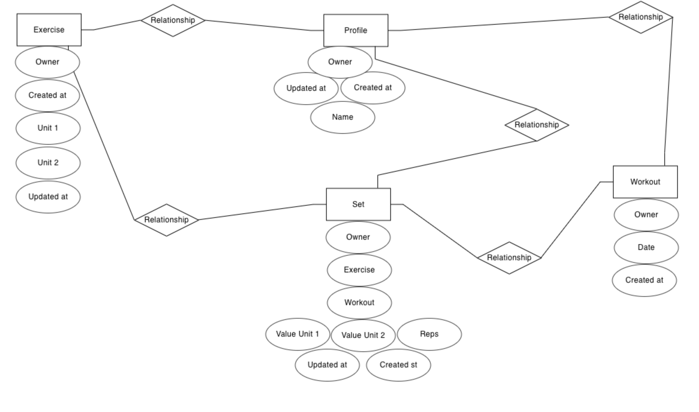

# **_Workout Log API - Django REST Framework API_**

This repository is the back-end REST API which is used by my front-end project, Workout Log.

You can view the live site here - <a href="https://workout-log-api.herokuapp.com/" target="_blank" rel="noopener">Workout Log</a>

You can view the live API here - <a href="https://workout-log-api.herokuapp.com/" target="_blank" rel="noopener">Workout Log DRF API</a>

You can view the front-end README.md here - <a href="https://github.com/MikeR94/ci-project-portfolio-5" target="_blank" rel="noopener">Workout Log Front-End README</a>

 Contents

- [**Objective**](#objective)
- [**Entity Relationship Diagram**](#entity-relationship-diagram)
- [**Database**](#database)
- [**Models**](#models)
- [**Testing**](#testing)
  - [**Manual Testing**](#manual-testing)
- [**Technologies Used**](#technologies-used)
- [**Bugs**](#bugs)
- [**Deployment**](#deployment-to-heroku)
- [**Credits**](#credits)
- [**Acknowledgments**](#acknowledgements)

# Objective

The main goal behind developing this API is to ensure a fast, dependable, and secure data delivery system for my Workout Log front-end project. I strive to create straightforward, user-friendly models that accurately represent the project's data requirements. Each API endpoint serves a distinct purpose and undergoes rigorous testing to safeguard against unauthorized data manipulation, ensuring that only users with appropriate permissions can create, modify, or delete data.

PICTURE OF RELATIONSHIP

[Back to top](#contents)

# Entity Relationship Diagram

For creating the entity relationship diagram, I utilized a graph modeling tool called ERDPlus

[Back to top](#contents)

# Database

For this project, I incorporated two databases.

The first one is SQLite, which was utilized for development purposes. It offers a compact, fast, and self-contained SQL database engine.

The second database is a PostgreSQL database hosted by ElephantSQL, which serves as the production database.

# Models

## Profile

Database Value | 	Field Type	| Field Argument
 -------------- | ------------- | ---------------------------------- |
owner	|OneToOneField	|User, on_delete=models.CASCADE
created_at	|DateTimeField	|auto_now_add=True
updated_at	|DateTimeField	|auto_now=True
name	|CharField	|max_length=255, blank=True

## Exercise:

Database Value | Field Type	Field | Argument
 -------------- | ------------- | ---------------------------------- |
owner	| ForeignKey| 	User, on_delete=models.CASCADE
created_at	| DateTimeField| 	auto_now_add=True
updated_at| 	DateTimeField| 	auto_now=True
name| 	CharField	max_length=255, unique=True
unit_1| 	CharField| 	max_length=40, choices=unit_choices, default='kg'
unit_2| 	CharField| 	max_length=40, choices=unit_choices, default='', blank=True

unit_choices:
'kg' - kg
'sec' - sec
'm' - m

## Workout:

Database Value|	Field Type |	Field Argument
 -------------- | ------------- | ---------------------------------- |
owner|	ForeignKey	|User, on_delete=models.CASCADE
created_at	|DateTimeField 	|auto_now_add=True
date |	DateField	|default=datetime.date.today

## Set

Database Value	|Field Type	|Field Argument
-------------- | ------------- | ---------------------------------- |
owner	|ForeignKey	|User, on_delete=models.CASCADE
exercise	|ForeignKey	|Exercise, on_delete=models.CASCADE, related_name='sets'
workout	|ForeignKey	|Workout, on_delete=models.CASCADE
created_at	|DateTimeField	|auto_now_add=True
updated_at	|DateTimeField	|auto_now=True
reps	|PositiveIntegerField|	
value_of_unit_1	|IntegerField|	
value_of_unit_2	|IntegerField	|default=None, blank=True

# Testing

- ## Manual Testing

| Application | Endpoint                  | Expected Result                                                                                                                                            | Pass/Fail |
| ----------- | ------------------------- | ---------------------------------------------------------------------------------------------------------------------------------------------------------- | --------- |
| workouts   | workouts/                | Return a list of all the workouts in the database ordered by date created                                                                                         | Pass      |
| workouts   | workouts/                | Creates a record only if the user is logged in                                                                                         | Pass      |
| workouts   | workouts/<int:pk>/       | Returns a single workout with a correct ID and a list of all it's values                                                                                  | Pass      |
| exercises   | exercises/                | Return a list of all the exercises in the database ordered by date created                                                                                         | Pass      |
| exercises   | exercises/                |  Creates a record only if the user is logged in                                                                                         | Pass      |
| exercises   | exercises/<int:pk>/       | Returns a single exercise with a correct ID and a list of all it's values                                                                                  | Pass      |
| profile   | profile/                | Return a list of all the profile in the database ordered by date created                                                                                         | Pass      |
| profile   | profile/       | Creates a record only if the user is logged in                                                                                  | Pass      |
| profile   | profile/<int:pk>/       | Returns a single profile with a correct ID and a list of all it's values                                                                                  | Pass      |
| sets   | sets/                | Return a list of all the sets in the database ordered by date created                                                                                         | Pass      |
| sets   | sets/     | Creates a record only if the user is logged in                                                                                  | Pass      |
| sets   | sets/<int:pk>/       | Returns a single set with a correct ID and a list of all it's values                                                                                  | Pass      |

# Bugs

During the creation of the project, no significant bugs were encountered. The development process proceeded smoothly, allowing for efficient implementation and testing of the various features and functionalities. This ensured a robust and reliable final product, free from major issues.

# Technologies Used

## Languages and Frameworks

- Django
- Django REST Framework
- Python 3.8

## Packages

- dj-database-url: This library enables the utilization of the DATABASE_URL environment variable, following the principles of the 12-factor app, to configure the database settings in a Django application.

- dj-rest-auth: A comprehensive set of API endpoints designed to handle authentication securely within the Django Rest Framework.

- django-allauth: An integrated suite of Django applications that addresses various aspects of authentication, registration, and account management, including support for third-party (social) account authentication.

- django-cors-headers: This package automatically adds Cross-Origin Resource Sharing (CORS) headers to responses in a Django project, allowing for controlled access to resources from different origins.

- django-rest-auth: Provides a complete set of REST API endpoints for authentication and registration functionalities in Django.

- djangorestframework-simplejwt: A plugin for the Django REST Framework that enables JSON Web Token (JWT) authentication, ensuring secure and efficient token-based authentication for API endpoints.

- gunicorn: A powerful Python WSGI HTTP Server primarily used for UNIX systems, facilitating the deployment and management of Django applications in production environments.

- psycopg2: This PostgreSQL database adapter serves as a bridge between Python and PostgreSQL, enabling seamless communication and interaction between the two.

- pycodestyle: A useful tool for checking Python code against the style conventions outlined in PEP 8, helping developers maintain clean and consistent code formatting.

- pydot: This library allows for the generation of .dot files, which are commonly used to represent Entity-Relationship Diagrams (ERDs) and visualize data models.

- PyJWT: A versatile library that provides functionality for encoding and decoding JSON Web Tokens (JWTs), enabling secure token-based authentication and authorization in Python applications.

# Deployment 
- Install Django and Gunicorn. Gunicorn is the server I am using to run Django on Heroku.
- Install support libraries including psycopg2, this is used to connect the PostgreSQL database
- Create the requirements.txt file. This includes the project's dependencies allowing us to run the project in Heroku.

- Create a new, blank Django Project
    - Create a new project
    - Create the app
    - Add restaurant_booking to the installed apps in settings.py
    - Migrate all new changes to the database
    - Run the server to test

- Setup project to use in Heroku
    - Create new Heroku app
        - Sign into Heroku
        - Select New
        - Select create new app
        - Enter a relevant app name
        - Select appropriate region
        - Select the create app button

    - Prepare the environment and settings.py file
        - Create env.py file
        - Add DATABASE_URL with the Postgres URL from Heroku
        - Add SECRET_KEY with a randomly generated key
        - Add SECRET_KEY and generated key to the config vars in Heroku
        - Add if statement to settings.py to prevent the production server from erroring
        - Replace insecure key with the environment variable for the SECRET_KEY
        - Migrate changes to new database

    - Create a database in ElephantSQL
        - Create account and create new instance
        - Select a plan and an apropiate name
        - Select a region near the user location
        - Add DATABASE_URL with the ElephantSql URL 

    - For the final deployment to Heroku, I had to:
        - Commit and push all files to GitHub
        - In the deploy tab, go to the manual deploy sections and click deploy branch.

# Credits 
The Workout Log's requirements served as the inspiration for this project, which was initially developed by following the Code Institute DRF-API walkthrough and subsequently customized accordingly.

